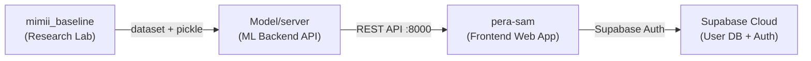
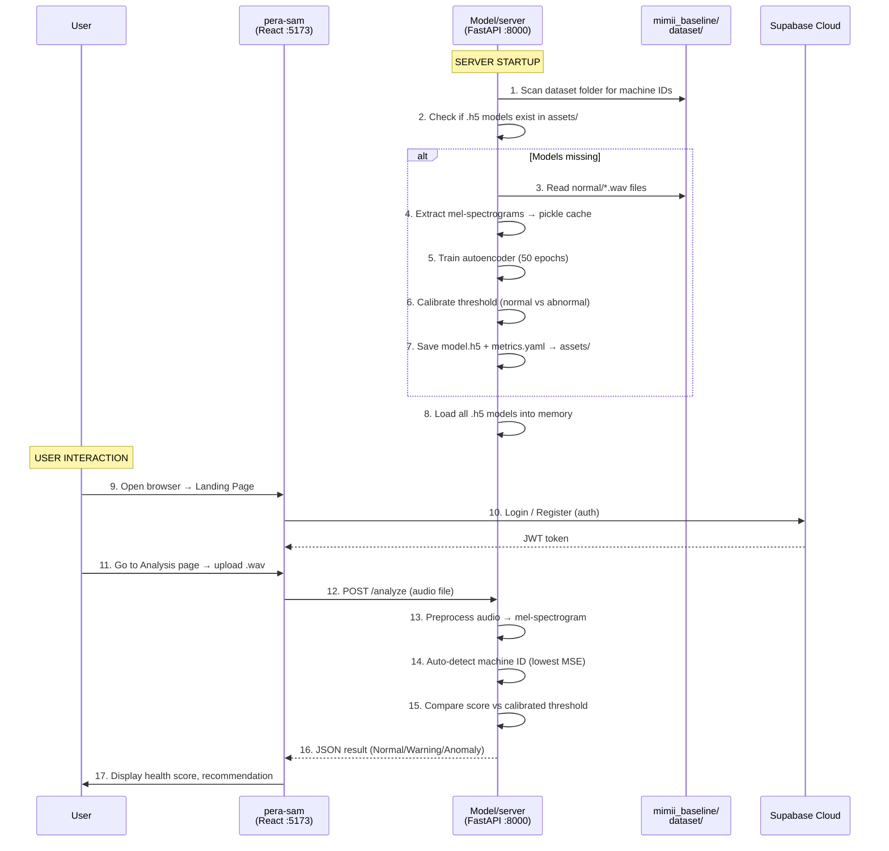

  

# AI Sound Analyst & Health Manager for Industrial Assets

  

> ## 📖 Overview
**PERA-SAM** (Predictive Equipment Reliability & Acoustics - Sound Analysis Manager) is a centralized acoustic management system designed to listen to the "heartbeat" of machines. 

Traditional maintenance is reactive—fixing things only after they break. PERA-SAM shifts this to a **predictive** model. By processing acoustic signatures using FFT (Fast Fourier Transform) and MFCC, the system detects subtle frequency shifts caused by friction, imbalances, or wear *before* catastrophic failure occurs.

Currently prototyped for **laptop cooling fans, server fans, engine fans**, this system is designed to scale up to heavy industrial machinery and vehicle engines.

> ## 🚀 Key Features
* **🩺 AI Sound Doctor:** Captures audio to generate a real-time "Health Score" for assets.
* **🔮 Predictive Maintenance:** Estimates Remaining Useful Life (RUL) to prevent unexpected downtime.
* **🧠 Self-Learning (Human-in-the-Loop):** A feedback mechanism where technicians validate AI predictions to constantly improve model accuracy.
* **📊 Fleet Dashboard:** A web-based portal (Flask/Django) to manage diverse assets, from small electronics to heavy vehicles.

> ## 🛠️ Tech Stack
* **Core Logic:** Python
* **DSP & Audio:** Librosa, NumPy (FFT/MFCC extraction)
* **Machine Learning:** Scikit-Learn (Anomaly Detection)
* **Backend/UI:** Flask / Django
* **Database:** SQLite / PostgreSQL

> ## 1. System Architecture Overview

| Folder | Role | Tech Stack |
|--------|------|------------|
| `mimii_baseline/` | Original Hitachi research code + raw dataset storage | Python, Keras, librosa |
| `Model/server/` | Production ML API — trains models, serves predictions | Python, FastAPI, TensorFlow, uvicorn |
| `pera-sam/` | Web dashboard — user login, upload audio, view results | React, Vite, TypeScript, TailwindCSS, Supabase |

> ## 2. Complete System Workflow

### Step-by-Step: What happens when you run the system

---
*Developed by [Invictus-Team29] - Faculty of Engineering, University of Peradeniya.*

     

