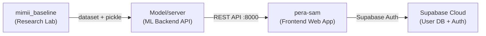
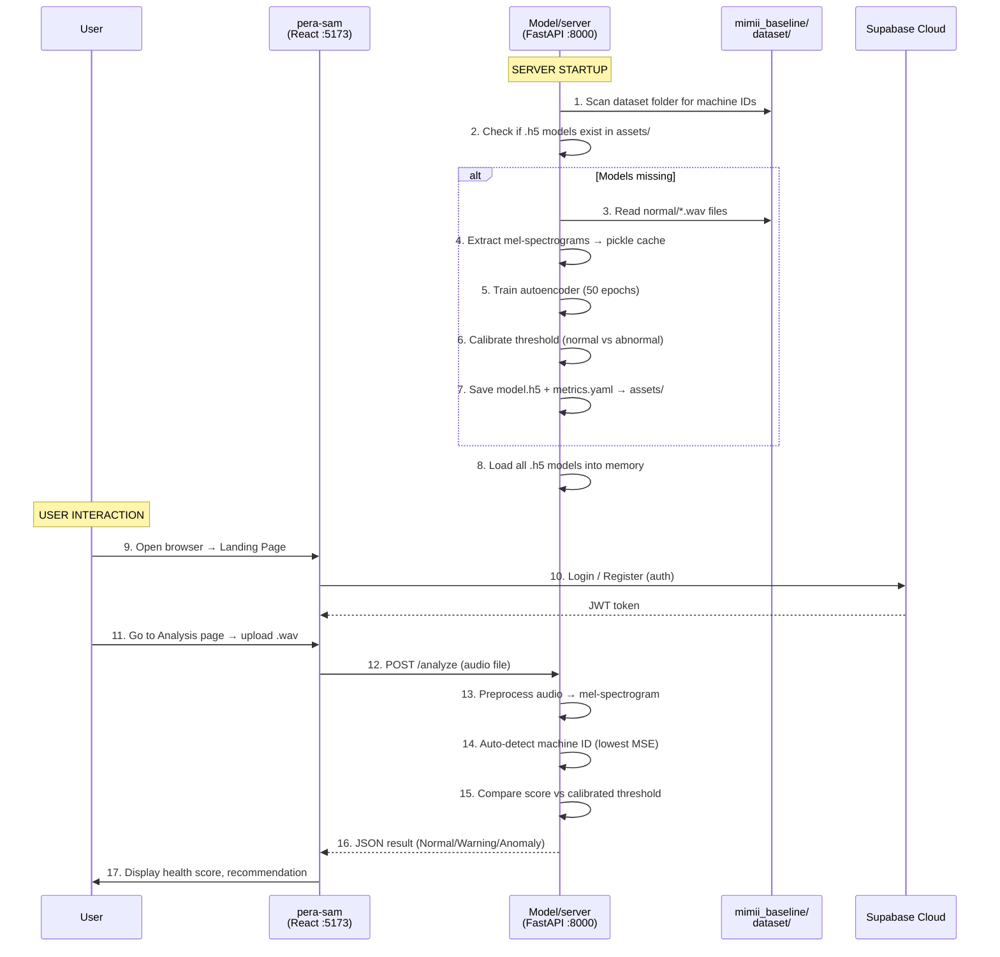

[comment]: # "This is the standard layout for the project, but you can clean this and use your own template, and add more information required for your own project"

<!-- Once you fill the index.json file inside /docs/data, please make sure the syntax is correct. (You can use this tool to identify syntax errors)

Please include the "correct" email address of your supervisors. (You can find them from https://people.ce.pdn.ac.lk/ )

Please include an appropriate cover page image ( cover_page.jpg ) and a thumbnail image ( thumbnail.jpg ) in the same folder as the index.json (i.e., /docs/data ). The cover page image must be cropped to 940×352 and the thumbnail image must be cropped to 640×360 . Use https://croppola.com/ for cropping and https://squoosh.app/ to reduce the file size.

If your followed all the given instructions correctly, your repository will be automatically added to the department's project web site (Update daily)

A HTML template integrated with the given GitHub repository templates, based on github.com/cepdnaclk/eYY-project-theme . If you like to remove this default theme and make your own web page, you can remove the file, docs/_config.yml and create the site using HTML. -->

  

## 🩺 AI Sound Analyst & Health Manager for Industrial Assets

---

## Team
-  E/22/184, Karunanayake K.P.B.P. , [email](mailto:e22184@eng.pdn.ac.lk)
-  E/22/396, Thilakarathna M. A. P. P., [email](mailto:e22396@eng.pdn.ac.lk)
-  E/22/188, Kavindya R. M. D. , [email](mailto:e22188@eng.pdn.ac.lk)
-  E/22/336, Sadaruwan D. M. D. , [email](mailto:e22336@eng.pdn.ac.lk)

<!-- Image (photo/drawing of the final hardware) should be here -->

<!-- This is a sample image, to show how to add images to your page. To learn more options, please refer [this](https://projects.ce.pdn.ac.lk/docs/faq/how-to-add-an-image/) -->

<!--  -->

#### Table of Contents
1. [Introduction](#introduction)
2. [Solution Architecture](#solution-architecture )
3. [Software Designs](#hardware-and-software-designs)
4. [Testing](#testing)
5. [Conclusion](#conclusion)
6. [Links](#links)

## 📖 Introduction

PERA-SAM (Predictive Equipment Reliability & Acoustics - Sound Analysis Manager) is a centralized acoustic management system designed to listen to the "heartbeat" of machines.

Traditional maintenance is reactive—fixing things only after they break. PERA-SAM shifts this to a predictive model. By processing acoustic signatures using FFT (Fast Fourier Transform) and MFCC, the system detects subtle frequency shifts caused by friction, imbalances, or wear before catastrophic failure occurs.

Currently prototyped for laptop cooling fans, server fans, engine fans, this system is designed to scale up to heavy industrial machinery and vehicle engines.

## Solution Architecture

| Folder | Role | Tech Stack |
|--------|------|------------|
| `mimii_baseline/` | Original Hitachi research code + raw dataset storage | Python, Keras, librosa |
| `model/server/` | Production ML API — trains models, serves predictions | Python, FastAPI, TensorFlow, uvicorn |
| `pera-sam/` | Web dashboard — user login, upload audio, view results | React, Vite, TypeScript, TailwindCSS, Supabase |

>### Step-by-Step: What happens when run the system

<!--High level diagram + description -->

## 🎨 Software Design

### 1. Frontend Design Patterns (React & TypeScript)
The client application follows a strict **Component-Based Architecture** and utilizes several React-specific design patterns to ensure the UI is maintainable and scalable.

*   **Atomic Design Principles:** UI elements are built using foundational, reusable primitive components (via Radix UI / Shadcn). These atomic components (like buttons and inputs) are combined into more complex organisms (like the `UploadForm` and `DashboardLayout`).
*   **Provider Pattern:** Global state, such as User Authentication and Theme Settings, is injected into the component tree using React Context (`AuthProvider`, `ThemeProvider`). This prevents prop-drilling across deeply nested pages.
*   **Container/Presenter Pattern:** Data fetching and asynchronous state management are completely decoupled from UI rendering using `@tanstack/react-query`. It handles the "Container" logic (caching, loading states, error handling), allowing the UI components to remain pure "Presenters."
*   **Wrapper Components (HOCs):** Security and routing are handled via wrapper components. For example, the `<ProtectedRoute>` component wraps dashboard routes, automatically redirecting unauthenticated users before the route even mounts.

### 2. Backend Design Patterns (Python & FastAPI)
The backend ML API is highly modularized, strictly separating the heavy Machine Learning logic from the HTTP routing layer.

*   **Modular Separation of Concerns:** 
    *   `main.py`: Handles the HTTP lifecycle, API routing, and CORS middleware.
    *   `trainer.py`: Encapsulates all logic for loading datasets, extracting features, and training models.
    *   `inference.py`: Contains the `SoundAnalyzer` logic dedicated purely to predicting anomalies.
*   **Singleton Pattern (Model Loading):** Machine learning models (`.h5` files) are large and slow to load. The `SoundAnalyzer` acts as a Singleton during the FastAPI `lifespan`. Models are loaded into memory *once* at server startup, enabling extremely fast, sub-second responses for subsequent `/analyze` requests.

## Testing

## Conclusion

## Links

- [Project Repository](https://github.com/cepdnaclk/e22-co2060-PERA-SAM)
- [Project Page](https://cepdnaclk.github.io/e22-co2060-PERA-SAM)
- [Department of Computer Engineering](http://www.ce.pdn.ac.lk/)
- [University of Peradeniya](https://eng.pdn.ac.lk/)

[//]: # (Please refer this to learn more about Markdown syntax)
[//]: # (https://github.com/adam-p/markdown-here/wiki/Markdown-Cheatsheet)
